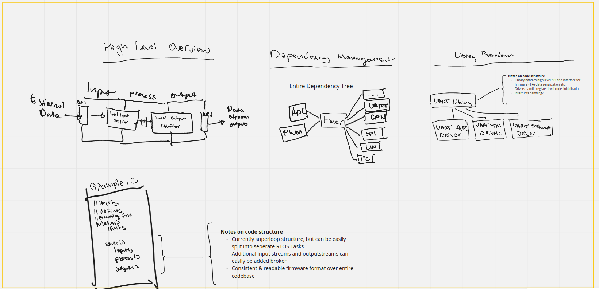

# AVR Hardware Abstraction Layer for EV firmware

### Team members: Adi Ramachandran | Course Assistant: Manu Patil | Prof: Steve Matsumoto

### Background 

The objective of this project is to build a proof of concept for a hardware abstraction layer (HAL) interface for our Formula vehicle's firmware. The [current revision](https://drive.google.com/file/d/1YjOPOfT_ilDgR61rJebSrrztOiRnLg4-/view) of our Formula SAE electric vehicle has over 14 custom-designed printed circuit boards (PCB's), each handling some function of the car's performance. All of these PCB's use the [Atmega16m1](http://ww1.microchip.com/downloads/en/DeviceDoc/Atmel-7647-Automotive-Microcontrollers-ATmega16M1-32M1-64M1-32C1-64C1_datasheet.pdf) microcontroller (MCU), an automotive MCU based on an AVR chip architecture. Each of these PCB's runs chip-specific [firmware](https://github.com/olin-electric-motorsports/mkv-code) with the large amounts of shared register level code. 

The intention of this project is to build out an abstraction layer that virtualizes the low and register level code required to interface with MCU peripherals in a clean and intuitive interface. Beyond just an AVR HAL, we also designed our interface to be chip agnostic, in the case where our team decides to upgrade our selection of MCU to a chip like the STM32. 


To demonstrate a proof of concept for this system, I built 2 full AVR peripheral 'vertical stacks', for the UART peripheral and the timer peripheral, and wrote 2 simple peices of firmware `timer_sample.c` and `UART_sample.c` to test both 'verticals'. 

For context, a peripheral vertical stack includes a driver layer interface (that is chip architecture specific) along with a library layer interface (that is chip architecture agnostic), all for a single microcontroller peripheral. This could be a timer, an ADC (analog digital converter), the UART interface, LIN interface, etc. 

Here's an example of the simplified timer interface. 

```
|firmware| -->calls--> |timer_library|-->calls-->|timer_driver|
```

The board level firmware only needs to interact with the timer_library. 

The end user / firmware engineer can simply import the required libraries and a constants file, call and reference the intuitive library layer interace. 

One additional finer detail that is important to the implementation The other primary design decision is the implementation of state structs for each peripheral. There exist 


My learning goals are to get more comfortable with writing AVR firmware, understand the required use cases of fimrware on our Formula SAE team in order to build a set of intuitive API's that meets their needs, and get comfortable thinking about embedded system library architecture. 

I've consulted heavily with Manu Patil, the course teaching assistant, to build this project in a way that will be useful for our Formula team in the long term. Manu has been an amazing resource over the course of this project. 


-- design decision -- 

This entire project revolved around architectural decisions 

-- code snippets -- 

-- project outcome -- 

-- next steps & vision-- 

The original objective, and what continues to be the long term objective is to build out a general purpose HAL. 

At a high level - 
- In general, support for alternative chip architectures should be added as needed. 


Parallel development - writing actual firmware using this HAL, and building this HAL out at the same time, is the strongest way to develop the HAL so that it's useful & intuitive for actual development. 

- 


Target audience: external evaluators / softsys students / students reading formula docs


Right now I'm working on finalizing the peripheral vertical for just the Atmega 16m1 timer. This includes a state management API, interrupt handling, and enums for common timer modes. After this, I'll move to building, testing, and flashing a sample peice of firmware that uses just the timer peripheral vertical. And after that, I'll move to updating and completing the ADC and UART drivers and libraries. 

### Links 

- [Trello Board](https://trello.com/b/evFEEQDQ/avr-hardware-abstraction-layer)
- [Github](https://github.com/aramachandran7/AVR_HAL_softsys_p1)


# Proposal 

## Objectives

The objective of this project is to function as a proof of concept for a new style of systems design oriented - firmware structure for our Formula SAE team. It involves building out hardware abstraction drivers for specific microcontrollers and their specific features our team uses (1) and higher level interfacable API's we can call within board firmware (2). 

### Lower bound

I will be working on (1) writing the drivers for at least 3 features - timer, UART, ADC - for the Atmega16M1 microcontroller. 

I'll also design & write the higher level API interfaces (2) for these 3 microcontroller features. 

### Upper bound

Depending on available time, I will work on building out more drivers (1) & libraries (2) and implementing these within certain projects. 

I'll also integrate this project's libraries into actual board firmware - starting with the `telemetry.c` firmware. Will then run tests and observe points of system failure. 


## Learning

Through this project I'm intending to learn more about
- embedded systems development & best practices in general - interrupts, registers, buffers, flags, etc. 
- quality embedded firmware code structure from a systems design perspective - superloops, libraries, passing around interrupts between libaries,
- improve familiarty with basic C syntax - header files, project directory structure

## Getting started

Resources to be used will be this [datasheet](http://ww1.microchip.com/downloads/en/DeviceDoc/Atmel-7647-Automotive-Microcontrollers-ATmega16M1-32M1-64M1-32C1-64C1_datasheet.pdf), the rest of the formula team's [firmware](https://github.com/olin-electric-motorsports/mkv-code), and [Manu](https://www.google.com/url?sa=i&url=https%3A%2F%2Fwww.huffpost.com%2Fentry%2Fwas-jesus-the-son-of-god-_b_7976430&psig=AOvVaw3jVRekuKmiTtUBye-nAQQK&ust=1614457963204000&source=images&cd=vfe&ved=0CAIQjRxqFwoTCOihwuyyiO8CFQAAAAAdAAAAABAD), the software systems CA. 

## First steps

In order to get started, let's start with a system level diagram of what needs to happen and the overall function and library / driver dependency tree. 



Reference the [Miro board](https://miro.com/welcomeonboard/FOmUawZ5cbtJwrPwp5qxJsDGcSkuQu6xTjJDfAP5yIE8iY9CYdOoj83QGHYZ06f0) to view the complete system diagram, as it's updated. 

From there we'll begin writing the drivers and libraries at the base of the dependency tree and move our way up.

For each feature (i.e. timer, ADC, etc), we'll need to consider how to provide a flexible but easy to understand and well documented interface for the microcontroller features our team uses. This requires referencing our team's firmware and seeing how we typically use certain features. 

Once the required features for the telemetry board are implemented, we'll write the telemetry board firmware using the libraries and drivers and run tests. 


## Forseeable issues
- Passing microcontroller interrupts between libraries and header files
- Cyclic dependencies between feature libraries
- Challenges in setting up hardware based test suite 


## questions 

1) What is the goal of your project; for example, what do you plan to make, and what should it do?  Identify a lower bound you are confident you can achieve and a stretch goal that is more ambitious.

2) What are your learning goals; that is, what do you intend to achieve by working on this project?

3) What do you need to get started?  Have you found the resources you need, do you have a plan to find them, or do you need help?

4) What are your first steps?  Describe at least three concrete tasks that you can do immediately, and identify which member of the team will do them.  For each one, what is the "definition of done"; that is, what will you produce to demonstrate that the task is done?